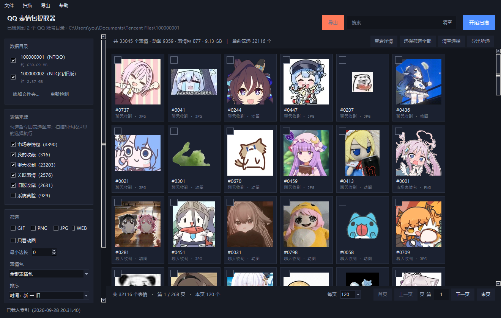
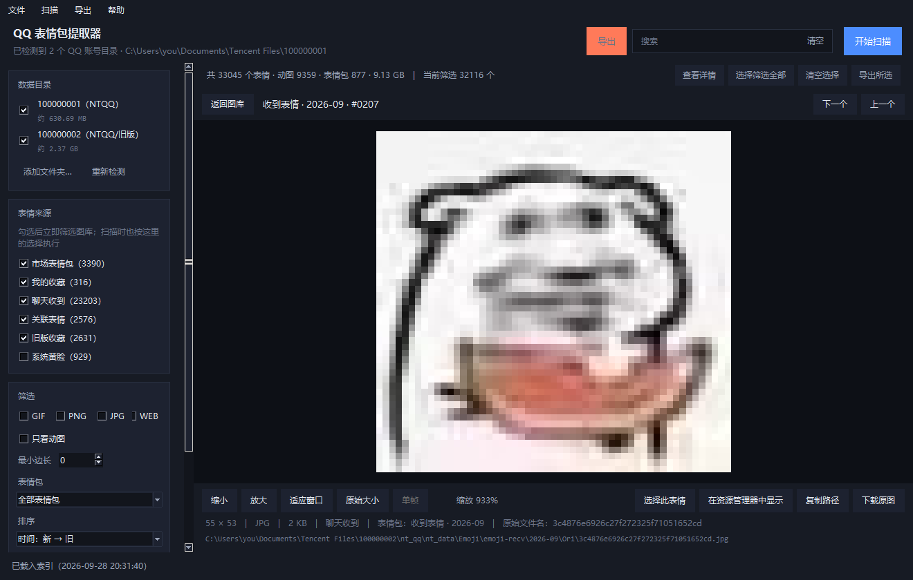
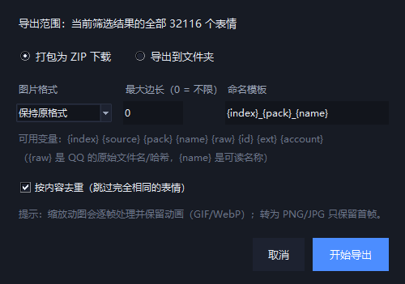

# QQ 表情包提取器 (QQ Emoji Exporter)

一个**纯本机运行**的桌面小程序：自动检测 QQ 数据目录，解析并导出其中所有表情包，
带缩略图图库、筛选搜索、大图预览、批量选择与 ZIP / 文件夹导出。

全程只读本地文件，**不联网、不上传任何数据**。

---

## 界面预览

图库：左侧筛选 + 顶部搜索，分页缩略图网格



详情视图：放大 / 缩小 / 适应窗口 / 原始大小，滚轮缩放、拖动平移、动图播放



导出：打包 ZIP 或写入文件夹，可转格式、限制边长、按内容去重、自定义命名模板



---

## 功能特性

| 能力 | 说明 |
| --- | --- |
| 路径自动检测 | 注册表扫描 + 系统「文档」已知文件夹（正确处理 OneDrive / 重定向）+ 常见路径 + 各固定磁盘浅层搜索，自动列出所有 QQ 账号；也可手动添加文件夹 |
| 多来源解析 | 市场表情包、我的收藏、聊天收到、联想表情、旧版 QQ 收藏、系统黄脸 |
| 自动解码 | 市场表情包原图做过一层混淆，程序自动还原为正常 GIF / PNG |
| 快速建索引 | 只读文件头即可得到格式、尺寸、是否动图，3 万多个表情几秒完成 |
| 分页图库 | 每页固定 60 / 120 / 240 条，翻页时才取数，内存占用恒定；缩略图按需生成并缓存 |
| 筛选与搜索 | 按来源、账号、格式、动图 / 静态、最小边长、表情包筛选；名称、关键词、原始文件名、表情包全字段搜索 |
| 排序 | 时间（新 / 旧）、体积（大 / 小）、名称、按表情包分组、随机 |
| 详情视图 | 主窗口内切换，放大 / 缩小 / 适应窗口 / 原始大小、滚轮缩放、拖动平移、动图自动播放 |
| 批量导出 | 打包 ZIP 或直接写入文件夹；可转 PNG / GIF / WebP / JPG、限制最大边长、按内容去重、自定义命名模板 |
| 后台任务 | 扫描与导出在后台线程执行，状态栏实时显示进度，可随时取消 |
| 本地索引 | 扫描结果存入本地 SQLite，下次打开秒开，无需重新扫描 |

### 常用操作

| 操作 | 说明 |
| --- | --- |
| 单击卡片 | 选中该表情 |
| `Ctrl` + 单击 | 多选 / 取消选择（跨页保留） |
| `Shift` + 单击 | 范围选择 |
| 双击卡片 | 打开详情视图 |
| 右键卡片 | 查看详情 / 下载 / 复制存储路径 / 在资源管理器中显示 |
| 选择筛选全部 | 一键选中**所有页**里符合筛选条件的表情，导出时不受当前页限制 |
| `Ctrl + A` / `Esc` | 全选筛选结果 / 关闭详情、清空选择 |
| `F5` / `Ctrl + E` | 重新扫描 / 打开导出面板 |

导出命名模板可用变量：`{index}` 序号、`{source}` 来源、`{pack}` 表情包名、`{name}` 可读名称、
`{raw}` QQ 原始文件名、`{id}` 内部 ID、`{ext}` 扩展名、`{account}` 账号。

---

## 快速开始

### 环境要求

- Windows 10 / 11
- Python 3.9 及以上（需包含 tkinter，官方安装包默认自带）
- 依赖：`Pillow`、`customtkinter`

### 方式一：双击运行（推荐）

```bat
run.bat
```

脚本会自动检查并安装依赖，然后打开程序窗口。

### 方式二：命令行

```bat
pip install -r requirements.txt
python app.py
```

### 命令行模式（不开界面）

```bat
python app.py --detect        :: 只检测 QQ 数据目录并打印
python app.py --info          :: 打印运行环境与索引信息
python app.py --scan          :: 扫描并建立索引，不打开界面
python app.py --scan --account "C:\Users\你\Documents\Tencent Files\123456789" --sources marketface,personal
```

---

## 打包

```bat
python tools\build.py          :: 或双击 打包.bat
:: 产物：QQEmojiExporter\QQEmojiExporter.exe（自带 Python 运行库，双击即用）
```

打出来的文件夹是**自包含**的，整个 `QQEmojiExporter\` 拷到哪台机器都能跑：

```
QQEmojiExporter\
├── QQEmojiExporter.exe     ← 双击运行
├── _internal\              ← 运行时依赖（解释器、tkinter、Pillow、CustomTkinter）
└── .cache\                 ← 索引、缩略图、导出的 zip 都在这里
    ├── index\              索引数据库
    ├── thumbs\             缩略图缓存
    └── exports\            导出的 zip
```

打包前建议**先关掉程序**，避免文件被占用。

---

## 缓存与目录

**缓存只写在程序目录里**，不会往 `%LOCALAPPDATA%`、`%TEMP%` 或上级目录乱放
（除非程序目录不可写，例如装在 `Program Files` 下，才会退到用户目录）。
也可以用环境变量指定：`set QQEMOJI_CACHE=D:\qq-cache`。

源码模式下缓存在项目根的 `.cache\`；打包版在 `QQEmojiExporter\.cache\`（各自集中，互不干扰）。
`.cache` 可以随时整体删除：缩略图会按需重新生成，索引需要重新扫描一次。

---

## 常见问题

**为什么有些表情有名字，有些是 `#0001` 这样的编号？**

名字只有 QQ 自己存了才有：市场表情包的名字来自同目录下的 `.jtmp` 元数据文件，
而「我的收藏」「聊天收到」「联想表情」这些来源的磁盘文件名本身就是内容哈希，QQ 不存名字。
因此程序把对人没意义的哈希名换成按文件名排序得到的稳定编号，拼成
`收到表情 · 2026-09 · #0041` 这样的可读名称，**原始哈希一个字节都没丢**：
搜索框粘贴哈希照样能搜到，模板里可以用 `{raw}` 取原始哈希。

**检测不到 QQ 目录？**

QQ 数据目录默认在「文档」下，如果被 OneDrive 接管或手动迁移过，自动扫描可能找不到。
用左侧「添加文件夹…」选择实际路径（指向 `Tencent Files` 这一级或某个 QQ 号目录）即可。
也可先执行 `python app.py --detect` 查看检测结果。

**缩略图一开始是转圈？**

缩略图按需在后台生成，第一次浏览某批表情时会有短暂转圈，之后就命中磁盘缓存了。
显示「无法预览」说明该文件本身损坏（QQ 缓存里偶有空白表情），不影响其它表情导出。

**扫描结果比预想少？**

「系统黄脸」默认不勾选（属于 QQ 自带素材）。旧版目录里的 53×53 小图是表情商城缩略图，
可以用「最小边长」筛选过滤掉。

**能边聊天边提取吗？**

可以，全程只读。但 QQ 正在写入的表情可能在扫描瞬间不完整，重新扫描即可。

---

## 声明

本项目仅用于**备份和导出自己电脑上已有的表情数据**，方便本地管理与迁移。
请勿用于传播盗版素材或侵犯他人版权；市场表情包版权归原作者及腾讯所有，请遵守相关协议。
